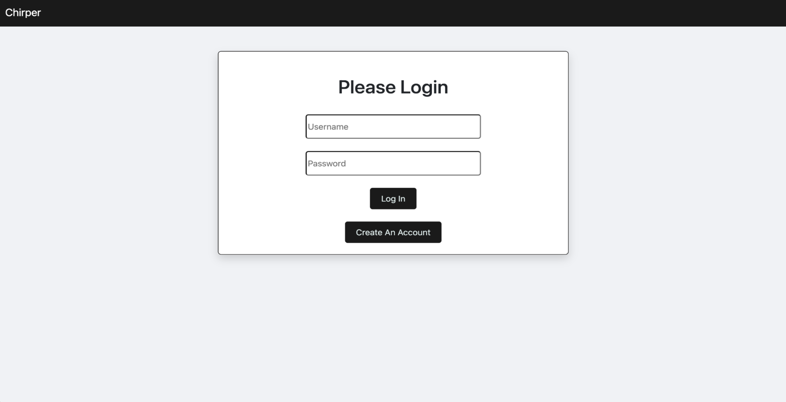

Project 2 "Chirper!!" Description: For this project, we were tasked to create a full-stack interactive application to showcase our skills as individual programmers and a team to potential employers. We had many challenging requirements to meet such as using Express file upload and Handlebars. 

The tecnologies we used were MVC Folder organization, MySQL, Sequelize, Handlebars, Bcrypt for password hashing, Cookies for storing current logged in user data and displaying data on the navbar, and Express file upload. 

The user story for our project is as follows: As a stressed hardworking person, a user needs a place to socialize and share digital contents for fund , good laugh and relaxation.

The user flow for our project is as follows: The user is first greeted by the login page. Here the user has the option to log in if they already have an account or, if they are a first time user, to sign up for a new account. Once logged in, the user is directed to their profile page. Here they can view or delete their previous posts, post text, or upload a picture. The User also has the option to log out from the profile page. The navbar at the top of the application allows the user to navigate between their home page and profile. If the user selects to view their home page, they are directed to their feed. Here, users can view, like, and comment on posts of their followers. 

